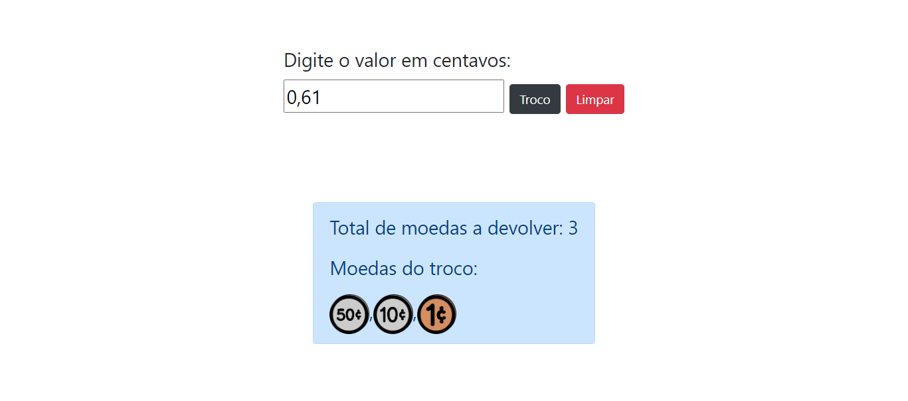

# Algoritmos Ambiciosos

Exercício proposto no módulo 1 do curso CS50.

## Enunciado:

Ao dar o troco, é provável que você queira minimizar o número de moedas que está distribuindo para cada cliente, para não acabar com o estoque (ou irritar o cliente!). Felizmente, a ciência da computação deu aos caixas em todos os lugares maneiras de minimizar o número de moedas devidas: algoritmos ambiciosos, também conhecidos como gulosos ou gananciosos.

## Print

## Link Surge

[Acesse aqui](https://verdant-comfort.surge.sh/)

Entre com o valor do troco em centavos e no formato de moeda brasileira.
Ex.: 0,98
O retorno é a quantidade mínima de moedas que você pode abater o troco.
