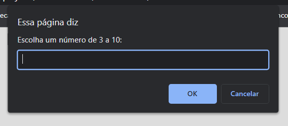
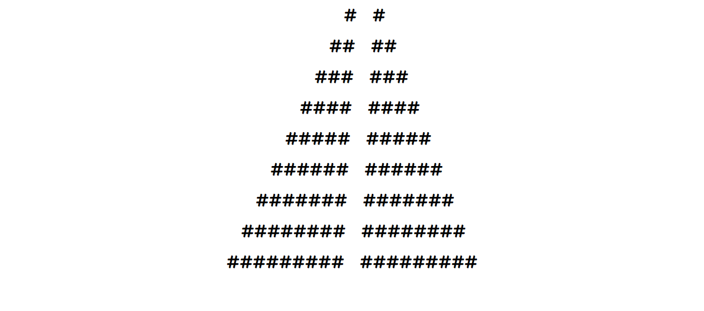

# Exercício 2: Mario (desafio)

Exercício proposto no curso online de Ciência da Computação, **CS50 de Harvard**.  
Lógica em **Javascript**.  
O desafio consiste em fazer o programa 'desenhar' uma estrutura que lembre a pirâmide de blocos do jogo Mario Bros, a partir de um valor informado pelo ususário que será o número de degraus da escada.

## Imagem do jogo (inspiração do exercício)

## Print do prompt

## Print da saída/output no navegador

### Conceito de lógica aplicado:
- Loops;

### Link Surge
[---> Aqui <---](https://ruddy-sofa.surge.sh/)
