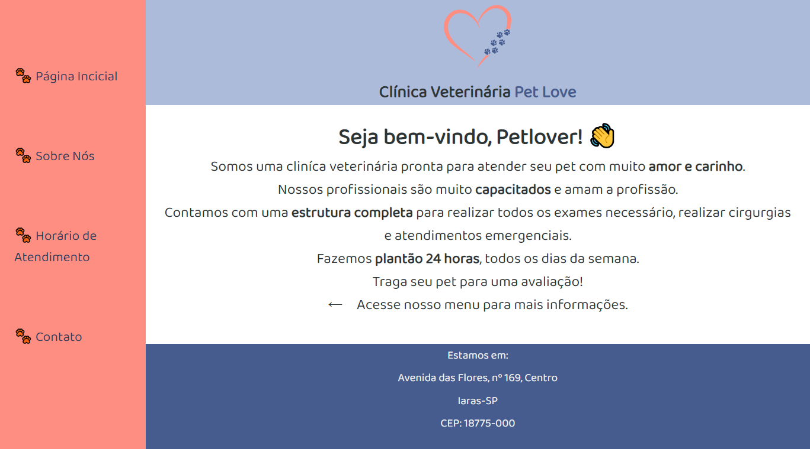
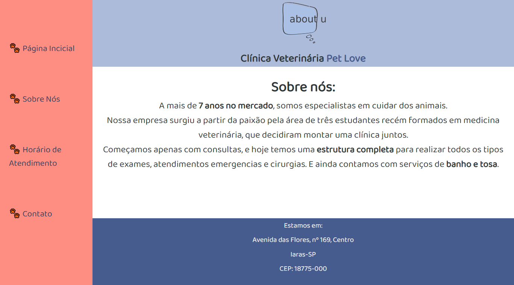
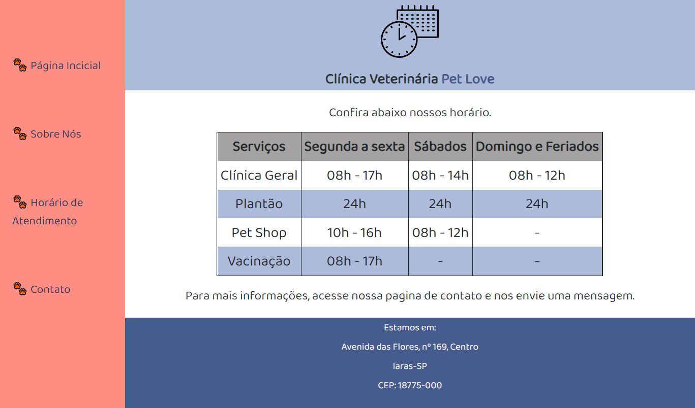
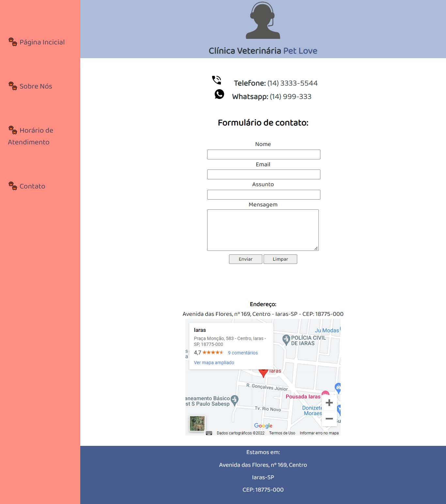

# Trilha HTML - Dio.me
## Módulo 02 - HTML I - Conceitos Básicos

Este desafio tem como objetivo, criar um site "quase" completo, com tudo o que vimos neste módulo. Os temas que deverão ser abordados são:
- Formulários
- Estruturação e formatação de texto
- Mídias
- Tabelas

Além de outros recursos falados nas aulas!

## Prints do projeto

  
<b>Credits</b>
 
  - Imagens<a href="https://www.vexels.com/?gclid=Cj0KCQjwhY-aBhCUARIsALNIC06imkM03vIQQmeG4YFWq41XUTLFeiEc9hI13veORkIfR22tCMvxIwoaAidpEALw_wcB"> Vexels</a> 
   - Template<a href="https://github.com/digitalinnovationone/trilha-html-modulo-2"> Dio.me</a>

